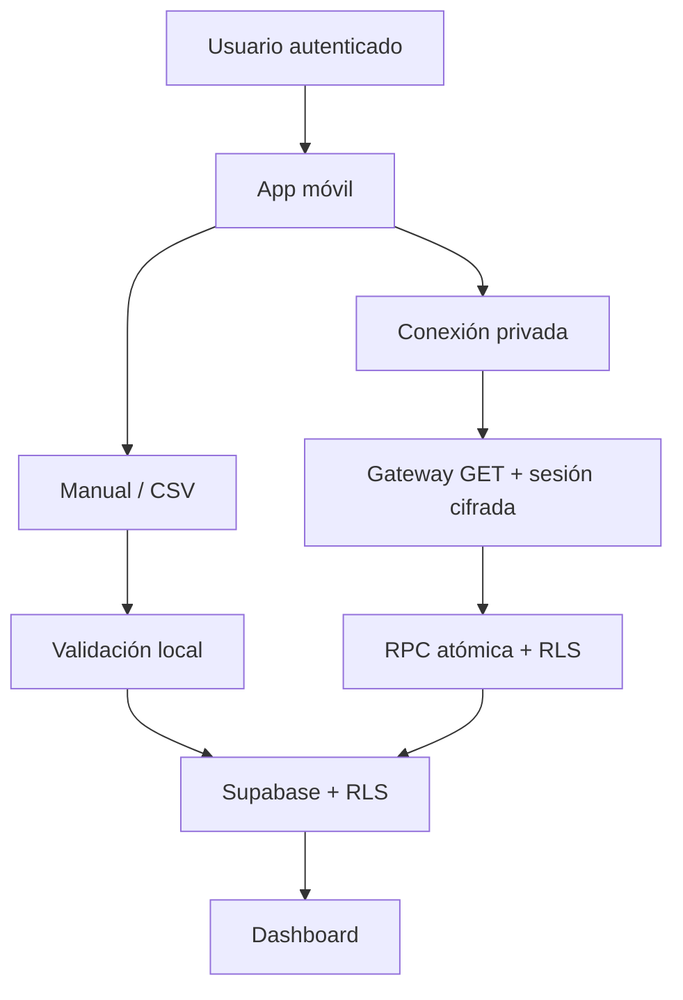
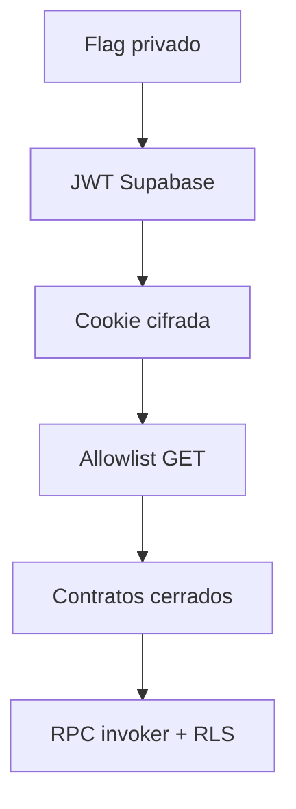

# Arquitectura

## Principio

Arquitectura móvil-first, barata y utilizable aunque falle cualquier proveedor externo. La conexión privada es la experiencia principal para el dueño; manual y CSV son un respaldo permanente y desacoplado.

## Flujos activos

Conexión privada:

1. El usuario inicia sesión en Fantasy Copilot.
2. El servidor reenvía las credenciales una vez a Azure B2C.
3. El token se cifra en una cookie ligada al usuario.
4. El usuario elige una de sus ligas.
5. El gateway consulta solo endpoints GET incluidos en una allowlist.
6. Los contratos normalizan o rechazan el snapshot completo.
7. `replace_laliga_snapshot` guarda todo en una transacción con RLS.

Respaldo:

1. El usuario crea o conserva su equipo.
2. Añade jugadores manualmente o importa un CSV.
3. El cliente valida y normaliza el contenido.
4. Supabase guarda el lote, sus filas y la plantilla con RLS por propietario.

## Componentes

- Next.js y React para frontend y Route Handlers.
- Supabase Auth, Postgres, RLS y RPC transaccional.
- `laliga-session.ts` para validar y cifrar sesiones.
- `app/api/laliga/*` como gateway privado, limitado y sin proxy genérico.
- `laliga-contract.ts` para contratos defensivos.
- `laliga-connection.tsx` para login, ligas, sincronización y desconexión móvil.
- `csv-import.ts` para el respaldo CSV.
- `import_batches` e `import_items` para trazabilidad de importaciones.
- Lovable para iteraciones visuales; GitHub sigue siendo canónico.
- OpenAI para explicaciones futuras, sin sustituir reglas deterministas.

## Decisiones del MVP

- Email y contraseña para Fantasy Copilot; acceso social después.
- Piloto LALIGA privado, de una cuenta, bajo demanda y solo lectura.
- Entrada manual y CSV funcionales y permanentes.
- Ningún refresh token ni sincronización con la app cerrada.
- Ninguna compra, venta, puja ni modificación de alineación.
- La beta está detrás de un flag desactivado por defecto.
- Claves publicables en cliente; `service_role` nunca.
- No se reutiliza código sin licencia del repositorio de referencia.

## Límite de confianza

La contraseña solo existe durante el login. El navegador no recibe el token en texto claro; Supabase no lo almacena. Si falla autenticación, origen, límites, contrato o persistencia, no se modifica el snapshot anterior.

## Riesgo principal

Los endpoints no son públicos, cambian por temporada y el login usa ROPC. La autorización actual pertenece al dueño de la cuenta para una prueba personal; no es aprobación oficial ni permite comercializar o distribuir la conexión.

## V2

El piloto automático requiere una integración estable y autorización adicional para escrituras. Empezará en simulación, continuará con confirmación por acción y solo después podrá incorporar reglas automáticas con límites, auditoría y parada inmediata.
