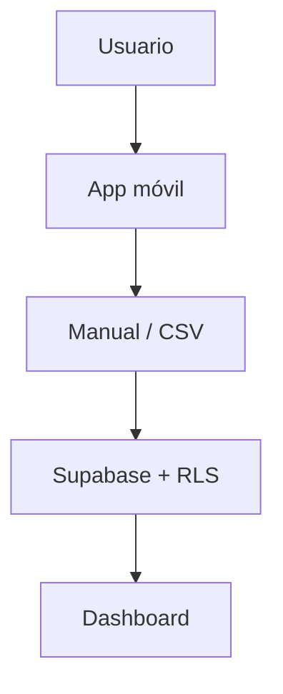
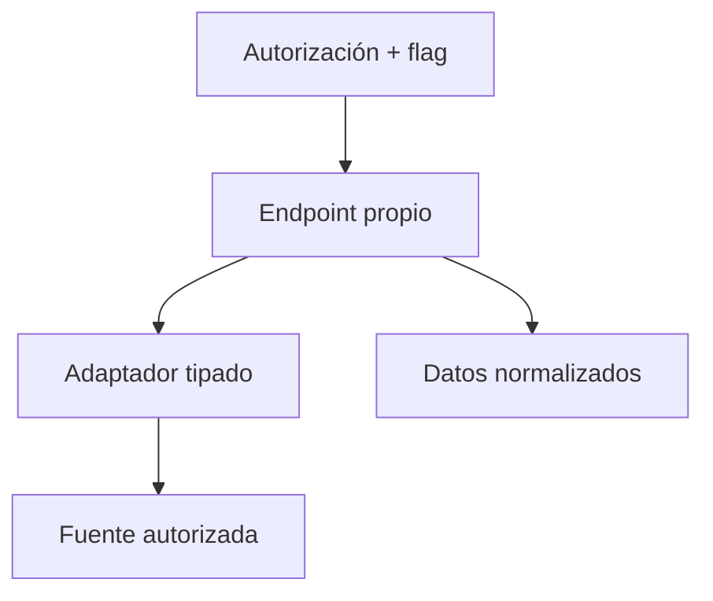

# Arquitectura

## Principio

Arquitectura simple, barata, móvil-first y utilizable aunque no exista ningún proveedor externo. Manual/CSV es el camino canónico; cualquier conector privado es opcional y no puede romper el producto.

## Flujo activo

1. El usuario crea una cuenta de Fantasy Copilot.
2. Crea su equipo.
3. Añade jugadores manualmente o importa un CSV.
4. El cliente valida y normaliza el contenido.
5. Supabase guarda el lote, sus filas y la plantilla con RLS por propietario.
6. El dashboard usa los datos privados disponibles.
7. Las métricas compartidas y recomendaciones se incorporarán mediante fuentes autorizadas.

## Componentes

- Next.js y React para el frontend móvil-first.
- Supabase para autenticación, Postgres, RLS y funciones de servidor.
- `csv-import.ts` para parseo, normalización y validación determinista.
- `import_batches` e `import_items` para trazabilidad de importaciones.
- `squad_players` para combinar referencias canónicas con jugadores importados.
- `laliga-provider.ts` como interfaz futura, sin implementación privada.
- Lovable para iteraciones visuales sobre el repositorio existente.
- OpenAI para explicaciones futuras, sin sustituir reglas deterministas.

## Decisiones del MVP

- Email y contraseña para Fantasy Copilot; acceso social después.
- Entrada manual y CSV funcionales y permanentes.
- Conexión automática con LALIGA bloqueada hasta autorización escrita.
- No se solicitan credenciales de LALIGA.
- No se implementan compras, ventas, pujas ni cambios de alineación.
- No se crean tablas o políticas desde el generador visual.
- Las claves publicables pueden vivir en cliente; `service_role` nunca.

## Límite futuro del proveedor

Este camino permanece desactivado. Si algún día se habilita, el endpoint deberá validar al usuario de Supabase, aplicar límites y timeouts, no registrar secretos, normalizar respuestas y ofrecer desconexión inmediata.

## Riesgo principal

Los endpoints investigados no son públicos, cambian por temporada y el login local usa ROPC. Además, las condiciones oficiales revisadas exigen consentimiento escrito para uso comercial. Por eso el conector no forma parte del MVP aprobado.

## V2

El piloto automático solo puede empezar después de una integración autorizada y estable. Tendrá primero modo simulación, después confirmación por acción y solo finalmente reglas automáticas con límites, auditoría y parada inmediata.
