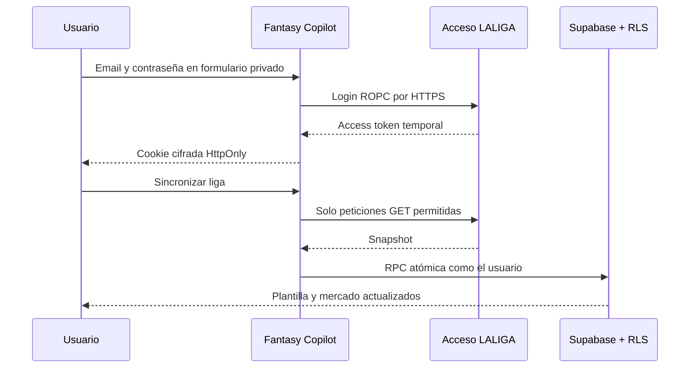

# Integración LALIGA Fantasy en modo lectura

## Estado

**Piloto privado autorizado por el dueño de la cuenta el 27 de julio de 2026.**

La autorización cubre únicamente probar su propia cuenta, una liga cada vez y operaciones de lectura. No equivale a aprobación de LALIGA, no habilita distribución a terceros y no permite uso comercial ni escrituras.

Referencia oficial revisada: [Condiciones de uso de LALIGA Fantasy](https://www.laliga.com/informacion-legal/condiciones-de-uso-fantasy), actualización de 3 de julio de 2026.

## Alcance

Incluido:

- login local mediante Azure B2C ROPC;
- cuentas con email y contraseña;
- ligas del usuario, saldo, plantilla, alineación y mercado;
- sincronización iniciada expresamente por el usuario;
- una sesión temporal y cierre inmediato;
- persistencia atómica en las tablas protegidas por RLS.

Excluido:

- Google, Apple y Facebook;
- refresh token y sincronización en segundo plano;
- clasificación, actividad y datos rivales en este primer vertical slice;
- compras, ventas, pujas o cambios de alineación;
- acceso de terceros, publicación o monetización;
- cualquier código del repositorio de referencia sin licencia.

## Flujo de credenciales

La contraseña existe únicamente durante la petición de login y no se escribe en base de datos, cookies, logs de aplicación, Git o analítica. El access token se cifra con AES-GCM, se vincula al ID del usuario de Supabase y solo el servidor puede descifrarlo.

## Controles

- `LALIGA_PRIVATE_BETA_ENABLED` actúa como feature flag y kill switch.
- `LALIGA_SESSION_SECRET` es server-only y debe contener al menos 32 bytes aleatorios.
- Todas las rutas exigen un JWT válido de Fantasy Copilot.
- Login, sincronización y desconexión exigen mismo origen.
- Cookie `HttpOnly`, `SameSite=Strict`, `Secure` en producción y expiración igual o inferior a la del upstream.
- Respuestas `Cache-Control: no-store`.
- Body máximo, respuesta upstream máxima, timeout y rate limiting.
- Allowlist cerrada de endpoints GET; no existe proxy genérico.
- IDs validados y la liga elegida se vuelve a comprobar contra las ligas de la sesión.
- Ninguna ruta usa `service_role`.
- Los parsers fallan cerrados si cambia la estructura upstream.

## Persistencia atómica

`public.replace_laliga_snapshot`:

- usa `SECURITY INVOKER`, no `SECURITY DEFINER`;
- tiene `search_path` vacío;
- solo concede ejecución a `authenticated`;
- deriva el propietario desde `auth.uid()`;
- valida tamaño, posiciones, importes, IDs y duplicados;
- crea o actualiza únicamente el equipo del usuario;
- sustituye plantilla y mercado dentro de la misma transacción;
- marca el onboarding como completado;
- revierte todo ante cualquier error.

Si la lectura, el contrato o la RPC fallan, la plantilla anterior permanece intacta.

## Limitaciones operativas

ROPC es legacy y obliga a que la contraseña atraviese el backend. La API no es pública y puede cambiar, especialmente al inicio de la temporada 2026/27. Por ello:

- manual y CSV siguen disponibles;
- la beta permanece privada y desactivada por defecto;
- primero se prueba con la cuenta del dueño;
- un error de contrato detiene la sincronización;
- no se promete disponibilidad continua;
- cualquier distribución exige reabrir revisión legal, privacidad y autorización.

## Validación

Automática:

- contratos de ligas, plantilla, alineación y mercado;
- respuestas incompletas o modificadas;
- issuer, audience y expiración del access token;
- cifrado, manipulación de cookie y vínculo al usuario;
- lint, pruebas y build en GitHub Actions;
- asesores de seguridad de Supabase después de la migración.

Manual pendiente:

1. desplegar con flag y secreto server-only;
2. iniciar sesión en Fantasy Copilot desde iPhone;
3. introducir credenciales dentro de la app;
4. comprobar ligas y seleccionar una;
5. sincronizar y verificar saldo, plantilla y mercado;
6. recargar y confirmar persistencia;
7. desconectar y confirmar que la sesión deja de funcionar;
8. desactivar el flag tras la prueba si aparece cualquier cambio upstream.

## V2 y piloto automático

El piloto automático permanece en roadmap, no en implementación. Necesita autorización adicional para escrituras, sesiones renovables, simulación, límites económicos, confirmaciones graduadas, historial auditable y parada inmediata. No se construirá reutilizando este permiso de solo lectura.
