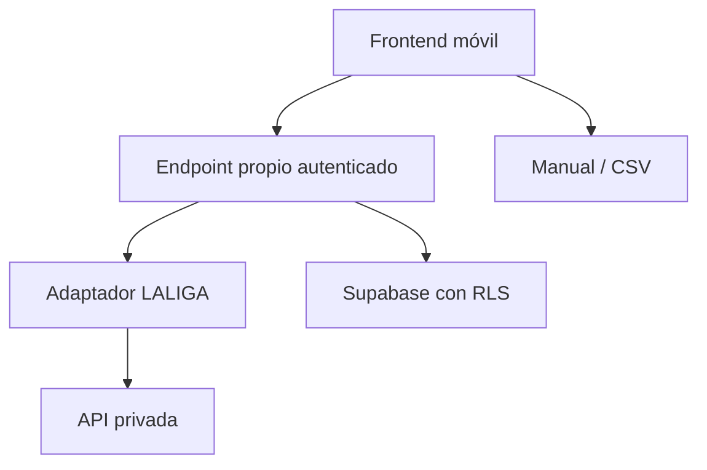

# Integración LALIGA Fantasy en modo lectura

## Estado de decisión

La integración real está **bloqueada** hasta obtener una base de uso aceptable. El MVP mantiene importación manual/CSV como vía canónica y solo puede construir, de momento, una simulación UX detrás de una feature flag.

La auditoría técnica confirma que existen contratos privados que cubren ligas, clasificación, plantilla, saldo, alineación y mercado, pero no confirma que sigan funcionando hoy. La autenticación observada usa ROPC de Azure B2C: obliga a que la contraseña pase por nuestra infraestructura y no cubre cuentas creadas exclusivamente con Google, Apple o Facebook.

Además, las condiciones oficiales de LALIGA Fantasy, actualizadas el 16 de julio de 2026, describen el juego para uso privado y no comercial y exigen consentimiento escrito expreso para uso comercial. Por prudencia, no se desplegará ni monetizará un conector basado en la API privada sin permiso escrito de LALIGA o revisión jurídica específica. Esta conclusión de producto no sustituye asesoramiento legal.

Fuente oficial: [Condiciones de uso de LALIGA Fantasy](https://www.laliga.com/en-GB/legal/condiciones-de-uso-fantasy).

## Objetivo futuro

Si se supera el bloqueo, permitir que un usuario presente conecte su cuenta para importar una vez liga, plantilla, saldo, alineación y mercado, sin automatizar acciones y sin almacenar contraseña o token.

## Alcance permitido ahora

- Importación manual y CSV.
- Modo demo completo.
- Interfaz simulada de conexión y estados de error.
- Adaptador tipado sustituible sin URLs reales.
- Alertas basadas en datos externos que no requieren acceso a la cuenta.

## Fuera de alcance

- Llamar a la API privada de LALIGA.
- Pedir credenciales reales en producción o en una beta pública.
- Persistir contraseña, token, cookie o sesión del proveedor.
- Comprar, vender, pujar, cambiar alineación o capitán.
- Ejecutar sincronización de la cuenta en segundo plano.
- Afirmar que la integración es oficial.
- Reutilizar código de repositorios de referencia sin licencia explícita o permiso del autor.
- Implementar el piloto automático de V2.

## Arquitectura objetivo, condicionada

Esta arquitectura es un contrato futuro, no una autorización para conectar. El frontend nunca llamará al proveedor ni recibirá secretos. En una sincronización autorizada, la Edge Function validaría la sesión de Supabase, usaría la credencial únicamente en memoria durante una sola pasada de lectura, normalizaría los datos y descartaría inmediatamente credencial y token.

Sin persistir credenciales no puede existir sincronización automática de datos privados. Cada actualización exigiría presencia y autenticación del usuario. Las alertas de la primera versión deben apoyarse en datos públicos/externos o en la última importación manual.

## Contrato del adaptador

El producto no debe depender de URLs o respuestas concretas del proveedor. El adaptador simulado expondrá operaciones tipadas equivalentes a:

- `authenticateEphemeral()`
- `listLeagues()`
- `getLeagueSummary()`
- `getSquad()`
- `getLineup()`
- `getMarket()`
- `disconnect()`

Toda respuesta se normaliza antes de guardarse. Los identificadores externos se mantienen separados de los UUID internos. Ningún método de escritura forma parte del contrato.

## Flujo UX aprobado para el vertical slice

1. El usuario pulsa **Conectar LALIGA Fantasy**.
2. Se informa de que es una integración experimental, no oficial y todavía no disponible.
3. Se explica qué datos importaría y que nunca actuaría sobre la cuenta.
4. El usuario puede recorrer una demostración con selección de liga y progreso simulado.
5. Se muestran estados de sesión caducada, cuenta social no compatible, proveedor caído, límite temporal y cambio de contrato.
6. Siempre se ofrecen carga manual y CSV.
7. No se muestra un formulario que pueda confundirse con un login real hasta superar Fase 0.

## Controles obligatorios si se autoriza

- Permiso escrito o validación jurídica documentada.
- Feature flag y kill switch.
- Consentimiento informado y revocable.
- Rate limiting por usuario y proveedor.
- Timeout corto y reintentos limitados.
- Allowlist estricta de endpoints de solo lectura.
- Redacción de secretos en logs y errores.
- Token vivo solo en memoria durante una sincronización.
- RLS por usuario en cualquier dato nuevo.
- Idempotencia para evitar duplicados.
- Métricas sin datos personales ni secretos.
- Pruebas de cuenta social, sesión caducada, respuesta incompleta y cambio de esquema.

## Implementación por fases

### Fase 0 — permiso y evidencia

- Conservar una copia fechada de las condiciones oficiales.
- Solicitar a LALIGA autorización para una integración de terceros, inicialmente solo lectura.
- Confirmar autenticación, endpoints, cobertura de login social y riesgo de bloqueo.
- No ejecutar URLs privadas ni aceptar credenciales durante esta fase.

### Fase 1 — producto sin conector

- Manual/CSV como suelo garantizado.
- Pantallas, tipos, adaptador simulado y estados de sincronización.
- Feature flag desactivada por defecto para cualquier flujo real.

### Fase 2 — spike privado autorizado

Solo tras superar Fase 0: una cuenta propia, una liga, una sincronización manual, solo lectura, token en memoria y trazas sin secretos.

### Fase 3 — revisión al iniciar temporada

Revalidar todos los contratos después del cambio efectivo a 2026/27. Un resultado previo no se considera garantía de estabilidad.

### Fase 4 — beta opt-in

Solo si las fases anteriores salen bien: pocos usuarios, consentimiento explícito, desconexión inmediata y monitorización de fallos.

## Criterios de aceptación actuales

- La app funciona mediante demo, manual y CSV sin depender de LALIGA.
- La simulación de conexión no pide ni transmite credenciales.
- Ninguna contraseña, token o secreto aparece en frontend, base, logs o Git.
- No hay escrituras ni automatización sobre cuentas de terceros.
- La interfaz no promete afiliación oficial ni disponibilidad de una conexión real.
- Lint, build y pruebas de estados pasan.
