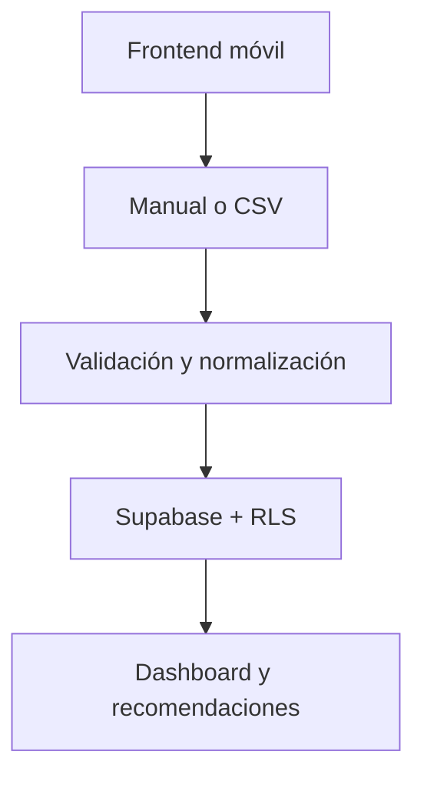

# Integración LALIGA Fantasy en modo lectura

## Estado de la decisión

**Bloqueada hasta obtener autorización escrita de LALIGA.**

La integración parece técnicamente viable para cuentas locales, pero no está aprobada para producto. Fantasy Copilot no pedirá credenciales, no ejecutará ROPC y no llamará a endpoints privados mientras no se resuelva este bloqueo.

Referencia oficial revisada: [Condiciones de uso de LALIGA Fantasy](https://www.laliga.com/informacion-legal/condiciones-de-uso-fantasy), actualización de 3 de julio de 2026.

## Evidencia de Fase 0

1. Existe un catálogo no oficial de endpoints que cubre ligas, plantilla, saldo, alineación, mercado y clasificación.
2. La autenticación observada usa ROPC de Azure B2C: la contraseña tendría que atravesar nuestra infraestructura.
3. ROPC no resuelve cuentas que dependen de Google, Apple o Facebook.
4. El repositorio de referencia tiene una señal de mantenimiento baja y no declara licencia; no se reutilizará su código sin permiso.
5. El catálogo no es puramente de lectura: incluye escrituras de mercado que quedan excluidas.
6. No hay garantía de funcionamiento actual; ya se documentó una rotura por cambio de temporada.
7. La temporada 2026/27 empieza en agosto, por lo que una validación técnica de julio puede caducar en semanas.
8. Sin guardar una credencial o sesión renovable no existe sincronización desatendida.
9. Las condiciones oficiales limitan el uso al ámbito personal/privado y requieren consentimiento escrito para uso comercial.
10. Automatización de mercado o alineación queda fuera de alcance incluso si se autoriza más adelante el modo lectura.

## Decisión de producto

- **MVP:** carga manual y CSV, disponibles y mantenidas como vía canónica.
- **Conector:** únicamente interfaz tipada, mocks y estados de UX.
- **Credenciales:** no se solicitan ni almacenan.
- **API privada:** no se invoca.
- **Operaciones de escritura:** no se implementan.
- **Promesa comercial:** no se presenta la conexión como disponible, oficial ni inminente.

## Arquitectura activa

`app/laliga-provider.ts` define el límite futuro del proveedor y devuelve el estado `blocked_by_terms`. No contiene autenticación ni URLs privadas.

## Puerta para reconsiderar la integración

Solo se abrirá un vertical slice real cuando se cumplan todas estas condiciones:

- autorización escrita para el caso de uso y modelo de distribución;
- cuenta de prueba propia y expresamente autorizada;
- revisión legal y de privacidad del paso de credenciales;
- cobertura o exclusión explícita de cuentas sociales;
- pruebas de contrato para la temporada vigente;
- feature flag, kill switch, rate limiting, timeouts y redacción de secretos;
- plan de caducidad, revocación y soporte;
- confirmación de que la beta empieza en solo lectura.

Si se autoriza, el primer diseño será un login efímero del lado servidor, token solo en memoria y sincronización iniciada por el usuario. Esa decisión implica que no habrá sincronización en segundo plano.

## V2 y piloto automático

El piloto automático permanece como objetivo de roadmap, no como compromiso técnico. Requerirá una autorización adicional para escrituras, modo simulación, límites económicos, confirmaciones graduadas, historial auditable y parada inmediata. No se construirá sobre endpoints privados sin permiso.

## Criterios de aceptación del MVP actual

- Manual y CSV funcionan sin catálogo canónico.
- Cada importación queda registrada en `import_batches` e `import_items`.
- RLS mantiene el aislamiento por usuario.
- Ninguna contraseña o token de LALIGA aparece en interfaz, base, logs o Git.
- Los estados de conexión explican el bloqueo y enlazan a la fuente oficial.
- Lint, tests y build pasan.
