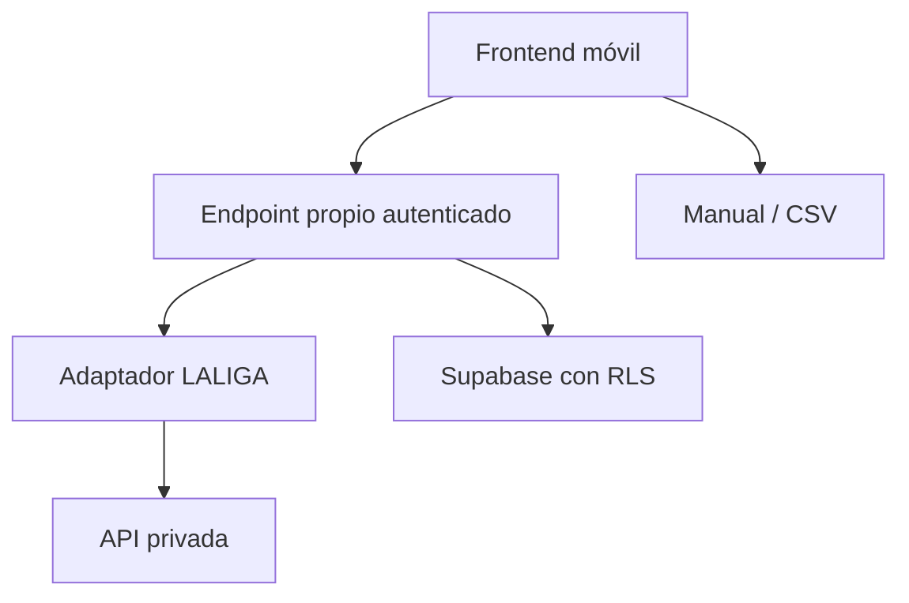

# Integración LALIGA Fantasy en modo lectura

## Objetivo

Permitir que un usuario conecte su cuenta para importar liga, plantilla, saldo, alineación y mercado sin automatizar acciones y sin almacenar su contraseña.

## Alcance permitido

- Lectura de ligas, clasificación y actividad.
- Lectura de plantilla, alineación y saldo.
- Lectura de mercado, precios y vencimientos.
- Sincronización manual iniciada por el usuario.
- Reconexión cuando la sesión expire.

## Fuera de alcance

- Comprar, vender o pujar.
- Cambiar alineación o capitán.
- Ejecutar acciones programadas sobre la cuenta.
- Guardar la contraseña de LALIGA.
- Llamar a la API privada desde el navegador.
- Afirmar que la integración es oficial.

## Arquitectura objetivo

El endpoint propio valida la sesión de Supabase. Las credenciales de LALIGA se usan solo durante el intercambio necesario para obtener una sesión y se descartan inmediatamente. Si es imprescindible persistir un token renovable, debe cifrarse del lado servidor, tener expiración y poder revocarse; nunca debe llegar al cliente ni aparecer en logs.

## Contrato del adaptador

El código de producto no debe depender de URLs o respuestas concretas del proveedor. El adaptador expondrá operaciones tipadas equivalentes a:

- `authenticateEphemeral()`
- `listLeagues()`
- `getLeagueSummary()`
- `getSquad()`
- `getLineup()`
- `getMarket()`
- `disconnect()`

Toda respuesta se normaliza antes de guardarse. Los identificadores externos se almacenan separados de los UUID internos.

## Flujo UX

1. El usuario pulsa **Conectar LALIGA Fantasy**.
2. Se explica el alcance de solo lectura y el riesgo de depender de una API no pública.
3. El usuario inicia una conexión segura.
4. El backend autentica sin registrar ni persistir la contraseña.
5. Si hay varias ligas, el usuario selecciona una.
6. Se importan liga, saldo, plantilla y mercado.
7. Se muestra la fecha de la última sincronización.
8. Si falla, se ofrece reintento, reconexión o carga manual/CSV.

## Controles obligatorios

- Feature flag y kill switch.
- Rate limiting por usuario y proveedor.
- Timeout corto y reintentos limitados.
- Redacción de secretos en logs y errores.
- Cifrado de cualquier token persistente.
- Expiración y desconexión.
- RLS por usuario en cualquier dato nuevo.
- Idempotencia para evitar duplicados.
- Métricas sin datos personales ni secretos.
- Pruebas de sesión caducada, respuesta incompleta y cambio de esquema.

## Implementación por fases

### Fase 0 — contrato y evidencia

Confirmar autenticación, endpoints, formato de respuesta, condiciones de uso y riesgo de bloqueo. No implementar URLs inventadas.

### Fase 1 — vertical slice seguro

Crear pantallas, tipos, adaptador simulado y estados de sincronización. Mantenerlo detrás de feature flag.

### Fase 2 — backend real

Implementar Edge Function o servicio propio, autenticación efímera, normalización y pruebas contra una cuenta de prueba autorizada.

### Fase 3 — persistencia

Proponer migración revisable para conexiones y sincronizaciones. No reutilizar columnas existentes con un significado distinto.

### Fase 4 — beta controlada

Activar solo lectura para pocos usuarios, monitorizar fallos y mantener desconexión inmediata.

## Criterios de aceptación

- Ninguna contraseña o token aparece en frontend, base sin cifrar, logs o Git.
- El usuario puede conectar, seleccionar liga y sincronizar los cinco bloques de lectura.
- Los fallos no eliminan datos anteriores ni bloquean la carga manual.
- Desconectar revoca o elimina la sesión guardada.
- Lint, build y pruebas de contrato pasan.
- La interfaz no promete afiliación oficial ni acciones automáticas.
